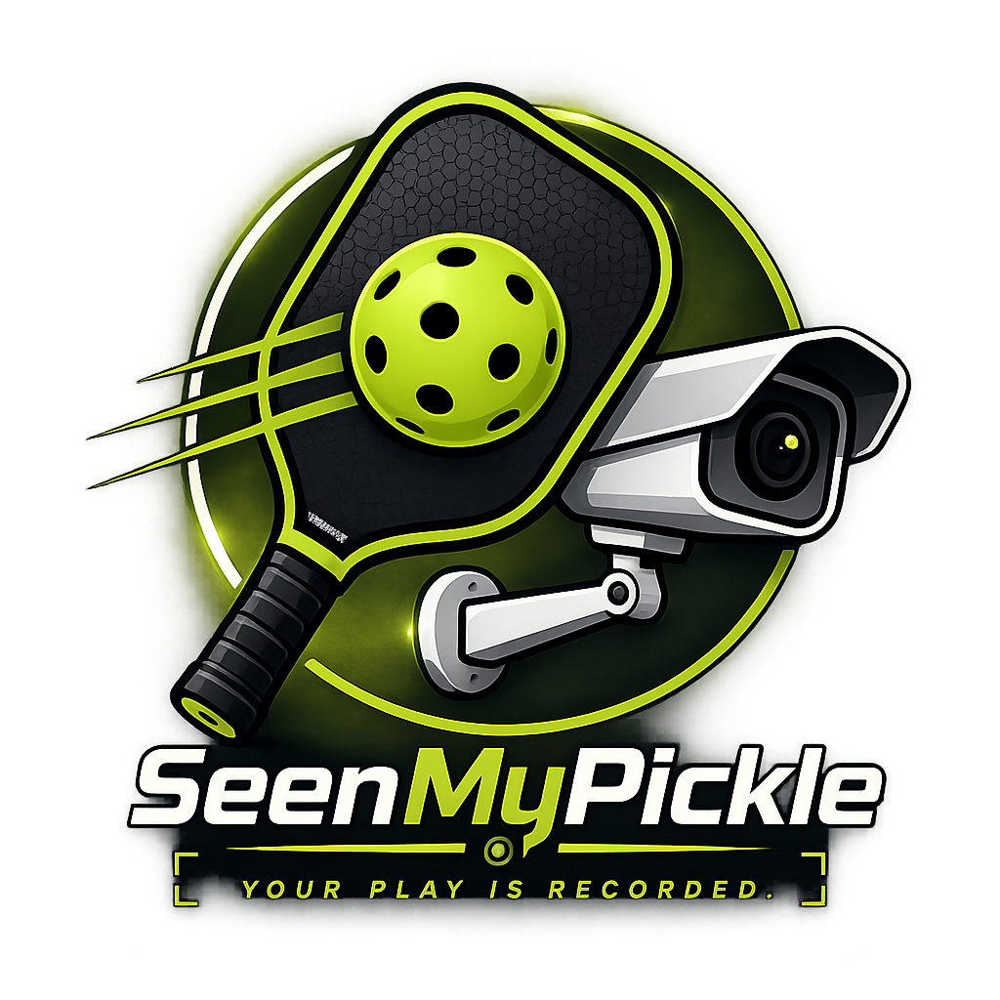

# SeenMyPickle (PBCam): 2026 Golden Build 🎾

SeenMyPickle is a professional-grade Android application designed for high-fidelity pickleball court monitoring. It features a robust multi-source recording engine, a secure hardware-locked licensing system, and a fully automated background processing pipeline. It is optimized for mid-range tablets and mobile devices, providing court owners with an "industrial-strength" solution for video capture and delivery.

---

## 🌟 Key Features

### 📹 Professional Recording Engine
- **Multi-Source Support**: High-fidelity capture from RTSP (CCTV), Internal, and USB cameras.
- **Resilient Capture**: Hardened FFmpeg capture with 50MB jitter buffers and packet reordering to absorb Wi-Fi fluctuations.
- **Jitter-Proof Video**: Mandatory `fps=30` and `setpts` normalization during post-processing for buttery-smooth motion.
- **Dual-Stream Strategy**: Utilizes high-res Main Streams for recording and low-latency Sub-Streams for dashboard monitoring.

### 🚀 Automated Pipeline
- **Hardware Acceleration**: Full hardware transcoding (MediaCodec) for watermarking and compression.
- **Automated Delivery**: Zero-friction upload to Google Drive and branded notifications via Gmail API.
- **Multi-Player Support**: Supports up to 5 player emails per session with smart chip-based UI.
- **Privacy First**: Automated email wiping and log sanitization after every match.

### 📺 PickleView TV (Supplementary App)
- **Public Display**: A dedicated TV module for 24/7 continuous court monitoring.
- **Tablet Presence**: 10-second active heartbeat detection with automated "Tablet Offline" alerts.
- **Instant Replay**: Automated handover from live feed to instant replay upon match completion via a local HTTP server.

### 🛡️ Secure Administration
- **Hardware Licensing**: Secure, hardware-locked product activation with real-time remote revocation (Firebase).
- **Admin Panel**: Sectioned technical settings for camera config, watermark customization, and storage maintenance.
- **Deep Diagnostics**: Comprehensive FFmpeg log capture and exit code transparency for rapid troubleshooting.

---

## 🏗️ System Architecture

SeenMyPickle follows **MVVM (Model-View-ViewModel)** with Clean Architecture principles:

- **UI Layer**: 100% Jetpack Compose with a custom branding-aligned design system ("Branding Bubbles").
- **State Management**: Reactive streams using Kotlin Coroutines and Flows.
- **Persistence**: Room Database for session tracking and WorkManager for offline-capable background processing.
- **Networking**: Resumable Google Drive uploads and low-latency Firebase Realtime Database status synchronization.

---

## 🛠️ Technology Stack

| Category | Technology |
| :--- | :--- |
| **Language** | Kotlin 1.9+ |
| **UI Framework** | Jetpack Compose (Material 3) |
| **Video Capture** | CameraX & FFmpeg (ffmpeg-kit) |
| **Video Playback** | Media3 (ExoPlayer) |
| **Background Tasks** | WorkManager |
| **Database** | Room SQLite |
| **Cloud / Sync** | Firebase RTDB & Google Drive API |
| **Authentication** | Google Identity Services |

---

## 🚦 Getting Started

### Prerequisites
1.  **Android Device**: Tablet or Mobile (Android 9.0+ recommended).
2.  **Internet**: Required for licensing and cloud delivery.
3.  **Google Account**: Required for footage storage and email alerts.

### Installation
1.  **Product Activation**: Upon cold launch, agree to the Setup Disclaimer and enter your 16-character SeenMyPickle license key.
2.  **Configuration**: Use the Setup Wizard to configure your camera (Auto-Scan for RTSP cameras is supported).
3.  **Authentication**: Connect your Google Account in the Admin Panel to enable footage delivery.

---

## 📝 Maintenance & Support

- **Storage**: Automatically purges local and cloud data based on a rolling retention policy (Default: 5 days).
- **Updates**: Silently checks for new versions on every cold launch.
- **Recovery**: Use the master override code **2026** for emergency administrative access.

---

## ⚖️ Disclaimer

*Footage is stored for a limited time based on your retention policy and is permanently deleted thereafter. Ensure players are aware that play is being recorded for monitoring purposes.*

**Developed by SeenMyPickle Smart Court Systems &copy; 2026. All rights reserved.**
